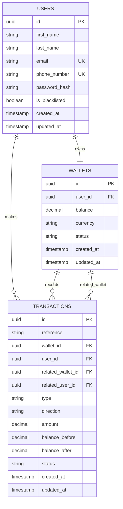

# Lendsqr Demo Credit Wallet API Service

Demo Credit is a small wallet service built for the Lendsqr backend engineering assessment. The product story is simple: a borrower needs a wallet to receive loan funds, move money to another user, and make withdrawals. The implementation follows that story closely, keeping the core wallet behavior explicit without building features the assessment did not ask for.

The application is written with Node.js, TypeScript, Express, Knex, and MySQL.

## What Was Built

The MVP supports:

- User account creation
- Lendsqr Adjutor Karma blacklist check before onboarding
- Wallet creation for every onboarded user
- Account funding
- Wallet-to-wallet transfers
- Withdrawals
- Transaction history
- Faux token authentication for protected wallet and transaction routes
- Unit tests for positive and negative service/controller paths

## Design Story

I started from the assessment requirement: "wallet functionality." A first instinct could be to put a `balance` field directly on the user, but that mixes identity with money movement. A user is the owner of an account; a wallet is the financial container. So the data model separates them:

- `users` stores identity/profile information.
- `wallets` stores balance and wallet state.
- `transactions` stores the ledger of balance movements.

That separation keeps the code easier to reason about. User code answers "who is this person?" Wallet code answers "can money move?" Transaction code answers "what happened?"

I kept the ledger minimal. There is no complex double-entry accounting engine, but every fund, withdrawal, and transfer creates transaction rows with balance snapshots. For transfers, two rows are recorded with the same reference: a debit for the sender and a credit for the recipient. That is enough for traceability while staying within MVP scope.

## Why This Folder Structure

The project is organized by business modules rather than by generic technical layers only:

```text
src/
  @types/                 Shared TypeScript contracts
  common/                 Shared response, async, and error helpers
  config/                 Environment, database, and logger setup
  database/               Knex connection and migrations
  middlewares/            Cross-cutting Express middleware
  modules/
    adjutor/              Lendsqr Adjutor Karma integration
    users/                User onboarding/profile logic
    wallets/              Wallet balance and money movement logic
    transactions/         Ledger/history logic
  utils/                  Small reusable utilities
```

This makes each feature easy to inspect. For example, all wallet behavior lives under `src/modules/wallets`, and all transaction history behavior lives under `src/modules/transactions`. The controllers stay thin, services hold business rules, repositories handle persistence, and models map database rows into API response shapes.

## Important Design Decisions

### Users and Wallets Are Created Atomically

When a user is created, their wallet should exist too. To avoid a case where a user exists without a wallet, `UserRepository.createWithWallet()` inserts both records inside one Knex transaction.

I kept that transaction in the repository instead of importing the database directly into the service. This avoids a circular service dependency and keeps persistence concerns in the persistence layer.
Another way i could have handle this is create user and queue wallet for creation.

### Faux Authentication Instead of JWT

The assessment says a full authentication system is not required. I used a simple faux token approach:

```http
x-user-id: <user-id>
```

or:

```http
Authorization: Bearer <user-id>
```

The middleware checks that the user exists and blocks access if the authenticated user id does not match the route user id. This is intentionally simple, but still prevents user A from calling user B's wallet routes.

### Wallet Operations Use Transactions

Funding, withdrawal, and transfer touch money. The repository uses Knex transactions and row locks where balances can be reduced. This is especially important for withdrawal and transfer because two concurrent requests should not spend the same balance twice.

### Transaction History Is a Ledger

The `transactions` table stores:

- transaction reference
- wallet id
- user id
- related wallet/user for transfers
- type
- direction
- amount
- balance before
- balance after
- status

This keeps audit history simple and useful.

### Adjutor Karma Check

Before onboarding a user, the app checks email and phone number against the Lendsqr Adjutor Karma endpoint. If `ADJUTOR_API_KEY` is not configured, the service returns `false` so the project can run locally. In a real deployment, `ADJUTOR_API_KEY` should be required.

## ER Diagram



## API Overview

Base URL locally:

```text
http://localhost:5400
```

### Health Check

```http
GET /
```

### Users

Create user:

```http
POST /api/users
Content-Type: application/json
```

```json
{
  "firstName": "Ada",
  "lastName": "Lovelace",
  "email": "ada@example.com",
  "phoneNumber": "08012345678",
  "password": "secret123"
}
```

List users:

```http
GET /api/users?page=1&limit=20
```

Get user:

```http
GET /api/users/:id
```

Blacklist user:

```http
PATCH /api/users/:id/blacklist
```

Unblacklist user:

```http
PATCH /api/users/:id/unblacklist
```

### Wallets

Protected wallet routes require `x-user-id` or `Authorization: Bearer <user-id>`.

Fund wallet:

```http
POST /api/wallets/:userId/fund
x-user-id: <user-id>
Content-Type: application/json
```

```json
{
  "amount": 5000
}
```

Withdraw:

```http
POST /api/wallets/:userId/withdraw
x-user-id: <user-id>
Content-Type: application/json
```

```json
{
  "amount": 2000
}
```

Transfer:

```http
POST /api/wallets/:userId/transfer
x-user-id: <sender-user-id>
Content-Type: application/json
```

```json
{
  "recipientUserId": "recipient-user-id",
  "amount": 1500
}
```

### Transactions

Fetch a user's transaction history:

```http
GET /api/transactions/users/:userId?page=1&limit=20
x-user-id: <user-id>
```

## Local Setup

### Prerequisites

- Node.js LTS
- MySQL
- pnpm

### Clone the Project

```bash
git clone https://github.com/obafemisolo/demo-credit-service
cd demo-credit
```

### Install Dependencies

```bash
pnpm install
```

### Configure Environment

Create a `.env` file in the project root:

```env
NODE_ENV=development
PORT=5400

DB_HOST=127.0.0.1
DB_PORT=3306
DB_USER=root
DB_PASSWORD=
DB_NAME=demo_credit

ADJUTOR_API_KEY=your_adjutor_api_key
```

Create the MySQL database:

```sql
CREATE DATABASE demo_credit;
```

### Run Migrations

```bash
pnpm db:migrate
```

### Start Development Server

```bash
pnpm dev
```

The API should be available at:

```text
http://localhost:5400
```

## Postman Collection

A ready-to-import Postman collection is included at:

```text
postman/demo-credit-wallet-api.postman_collection.json
```

Recommended flow after starting the server:

1. Import the collection into Postman.
2. Confirm the `baseUrl` collection variable is `http://localhost:5400`.
3. Run `Create Primary User - saves primaryUserId`.
4. Run `Create Recipient User - saves recipientUserId`.
5. Run wallet requests such as fund, withdraw, and transfer.

The collection has scripts that automatically save the created primary user id as `primaryUserId`. Protected wallet and transaction requests then send:

```http
x-user-id: {{primaryUserId}}
```

This mirrors the faux token authentication used by the API.

## Testing

Run unit tests:

```bash
pnpm test
```

Run TypeScript checks:

```bash
pnpm typecheck
```

Build the project:

```bash
pnpm build
```

Start compiled output:

```bash
pnpm start
```

## Validation and Error Handling

Input validation is kept close to each route through small Express validators. Invalid emails, UUIDs, missing amounts, invalid recipient ids, and non-positive transaction amounts are rejected early.

Errors flow through a shared error handler. Known application errors return clear status codes and messages. Unexpected errors return a generic internal server error response and are logged through Winston.

## Security Notes

This is intentionally not production authentication. The faux token exists because the assessment permits it. It proves protected endpoint ownership without adding JWT refresh tokens, sessions, password reset flows, or full auth infrastructure.

Security measures included:

- Helmet for baseline HTTP header hardening
- CORS configuration
- Input validation per route
- Faux token user ownership checks on wallet and transaction routes
- Blacklisted users blocked from wallet actions
- Passwords are not returned in API responses
- Wallet balance changes are done inside database transactions

Production improvements I would add:

- Real authentication with JWT or session-based auth
- Password hashing with bcrypt/argon2
- Rate limiting
- Request id tracing
- Structured audit logs
- Stronger money handling with integer minor units
- Idempotency keys for money movement endpoints
- Mandatory Adjutor API key in production
- Move blacklist/unblacklist user route/control to admin route/control (Simulated on Postman doc)

## Debugging and Reliability Approach

For failures, I would start from the request path: controller input, service decision, repository mutation, and database state. The code is structured to make that path easy to trace.

Example: if a transfer fails with "Insufficient balance", I would check:

1. The authenticated `x-user-id`
2. The sender wallet balance before the request
3. The requested transfer amount
4. The wallet repository transaction result
5. Whether a transaction ledger row was created

The goal is to keep failures observable without hiding them behind too much abstraction.

## Project Scripts

```bash
pnpm dev          # run server in watch mode
pnpm db:migrate   # run database migrations
pnpm db:rollback  # rollback last migration
pnpm test         # run unit tests
pnpm typecheck    # run TypeScript checks
pnpm build        # compile TypeScript
pnpm start        # run compiled app
```

## Final Note

This project intentionally stays focused on the assessment. It has enough structure to show maintainability and safe wallet behavior, but avoids building a full banking platform around a small MVP.
Thank you Ma/Sir for reading thus far.
